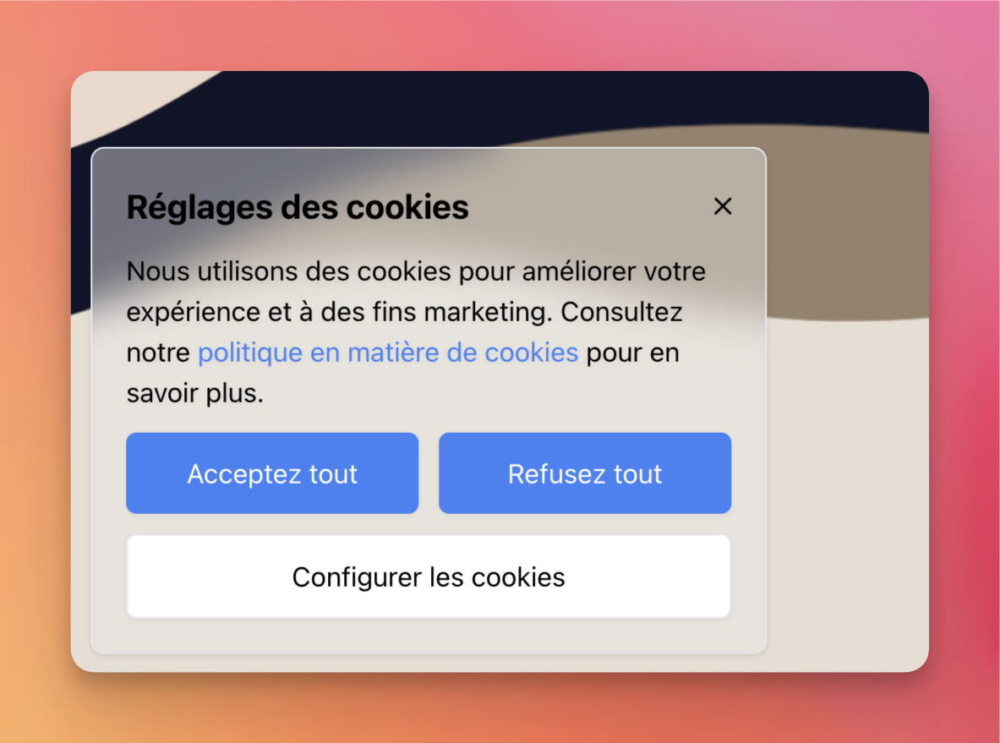

# Hive Consent `Version 1.0`



The Hive Consent package lets you add a cookie consent banner to your Laravel applications. The package is simple to use and easy to customize.

## Installation

### Prerequisites

- PHP >= 7.2
- TAILWIND CSS >= 2.0

### Step 1: Install the package via Composer

You can install the package via composer:

```bash
composer require hivedrops/hive-consent
```

### Step 2: Publish the config file

You can edit url for privacy policy and cookie policy with a variable in the `env` file:

```dotenv
HIVE_CONSENT_URL="/cookie-policy" // You can change this to your own url
```

if you want to change the default configuration, you can publish the config file:

```bash
php artisan hive-consent:publish-config
```

### Optional: Publish the views assets

If you want to customize the views, you can publish the views:

```bash
php artisan hive-consent:publish-views
```

A `hive-consent` directory will be created in your `resources/views/vendor` directory.

## Usage after installation

This package will enable you to generate cookies in your browser, so you'll need to adapt your codes to take account of the different user choices.

Here are the cookies that will be created automatically in the session:

- `cookies_accepted`: This cookie will be created when the user accepts the cookies.
- `necessary_cookies`: This cookie will be created when the user accepts the necessary cookies.
- `analytics_cookies`: This cookie will be created when the user accepts the analytics cookies.
- `advertising_cookies`: This cookie will be created when the user accepts the advertising cookies.

if you want to check if the user has accepted the cookies, you can use the following code:

```bladehtml
    @if(request()->cookie('cookies_accepted') == true)
        {{-- Your code here --}}
    @endif
```

## License

Hive Consent is open-sourced package licensed under the [MIT License](LICENSE).

## Credits

- [Hivedrops](https://hivedrops.re) - Web Development Agency


